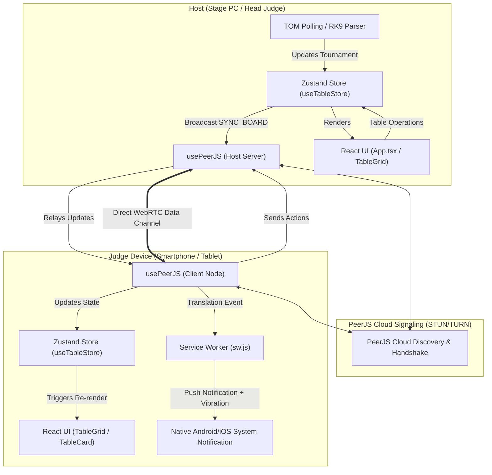

# Table Operations Grid (React Edition)

A modern, reactive, high-performance web application designed for real-time table monitoring and operations management at **Pokémon VGC and TCG** tournaments.

The application allows the **Tournament Organizer (Host)** and the **Judge / Staff** floor team to collaborate directly on the tournament floor without requiring dedicated backend servers. It synchronizes match statuses, judge calls, deck checks, and multilingual translation requests across PCs, tablets, and smartphones in real time.

---

## Table of Contents

1. [Architecture: How React Functions in this Application](#architecture-how-react-functions-in-this-application)
   - [No Backend Server: Serverless P2P Architecture](#no-backend-server-serverless-p2p-architecture)
   - [Data Flow and Reactivity (Zustand + React 19)](#data-flow-and-reactivity-zustand--react-19)
   - [Event Bus and System Push Notifications via Service Worker](#event-bus-and-system-push-notifications-via-service-worker)
   - [Real-Time Timers and Automated Ghost Table Detection](#real-time-timers-and-automated-ghost-table-detection)
   - [Architectural Flow Diagram](#architectural-flow-diagram)
2. [Folder Structure (Directory Tree)](#folder-structure-directory-tree)
3. [Comprehensive File-by-File Guide](#comprehensive-file-by-file-guide)
   - [Root & Configuration Files](#root--configuration-files)
   - [The `public/` Directory](#the-public-directory)
   - [The `src/` Directory (Entrypoint & Styles)](#the-src-directory-entrypoint--styles)
   - [The `src/components/layout/` Directory](#the-srccomponentslayout-directory)
   - [The `src/components/modals/` Directory](#the-srccomponentsmodals-directory)
   - [The `src/components/tables/` Directory](#the-srccomponentstables-directory)
   - [The `src/hooks/` Directory](#the-srchooks-directory)
   - [The `src/store/` Directory](#the-srcstore-directory)
   - [The `src/types/` Directory](#the-srctypes-directory)
   - [The `src/utils/` Directory](#the-srcutils-directory)
4. [Tournament Data Ingestion](#tournament-data-ingestion)
   - [1. RK9 Sync Bookmarklet (Recommended)](#1-rk9-sync-bookmarklet-recommended)
   - [2. Paste RK9 HTML](#2-paste-rk9-html)
   - [3. Auto-Sync with TOM (.tdf)](#3-auto-sync-with-tom-tdf)
5. [Getting Started & Development Guide](#getting-started--development-guide)
   - [Installation and Execution](#installation-and-execution)
   - [Mobile Device Setup & Push Notifications (HTTPS / Localhost)](#mobile-device-setup--push-notifications-https--localhost)

---

## Architecture: How React Functions in this Application

### No Backend Server: Serverless P2P Architecture
Unlike conventional web applications that rely on a Node.js/Python server and a central database, this platform runs **entirely client-side (browser-to-browser)** utilizing **WebRTC** via the **PeerJS** library:
- **Host Node (Master)**: The primary device (typically the stage PC or Head Judge laptop) loads the tournament pairings and creates an encrypted peer room identified by a 5-character session PIN (e.g. `PKM-A8F2K`).
- **Judges (Peer Clients)**: Floor staff join the room by scanning the generated QR code or typing the PIN on their smartphone or tablet.
- **Star Topology with Relay**: All judges establish WebRTC data channels with the Host. Whenever a judge interacts with a table (e.g. toggling a state or triggering a translation call), the action payload is dispatched to the Host, which acts as a real-time **relay**, broadcasting the update to all connected judges.

### Data Flow and Reactivity (Zustand + React 19)
React orchestrates the UI reactivity through a centralized state store implemented with **Zustand** (`useTableStore`):
1. **Single Source of Truth**: The store holds the active tournament data (`tournament`), custom table overrides (`tableStates`), player deck check flags (`playerStates`), and judge profile details (`myProfile`).
2. **Automatic Persistence**: Thanks to Zustand's `persist` middleware, all tournament and session states are continuously synchronized to `localStorage`. If an arbitrating judge accidentally refreshes the browser or reloads the tab, no operational data is lost.
3. **Surgical Component Re-renders**: React 19 components (such as individual `TableCard` components) subscribe exclusively to their relevant slice of state. This guarantees smooth 60fps rendering, even when rendering hundreds of active tables in a high-density grid.

### Event Bus and System Push Notifications via Service Worker
To handle multilingual translation requests, React integrates a custom DOM Event Bus (`window.dispatchEvent`):
1. When an incoming P2P action with type `TRANSLATION_REQUEST` is received, `usePeerJS` dispatches a custom `p2p_translation` event.
2. The root `App.tsx` component catches this event. If the requested language matches the languages configured in the judge's profile, it triggers a haptic vibration sequence (`navigator.vibrate`) and dispatches a **native system push notification**.
3. To ensure notifications wake mobile screens or pop up when Android Chrome is minimized, notifications are delegated through the registered **Service Worker** (`navigator.serviceWorker.ready -> registration.showNotification(...)`).

### Real-Time Timers and Automated Ghost Table Detection
Each `TableCard` manages an internal reactive effect (`useEffect`) that counts the elapsed time:
- **Judge Call Timer**: Displays an incrementing stopwatch (`⏱️ Mm Ss`) to track how long an ongoing ruling has taken.
- **Ghost Table Detection**: If a table is manually flagged as *Empty* (`empty`) by floor staff, but the official tournament data has not yet flagged the match as finished, the table automatically shifts into the **Ghost Table** alert state upon reaching **120 seconds (2 minutes)**. The card pulses with an attention-grabbing purple glow and warning badge, notifying judges that the match finished without players submitting their match slips.

---

### Architectural Flow Diagram



---

## Folder Structure (Directory Tree)

```text
table-ops-react/
├── .gitignore                   # Files and directories ignored by Git version control
├── .oxlintrc.json               # Oxlint static code analysis and linter configuration
├── index.html                   # Main HTML document mounting the React root container
├── package.json                 # Project dependencies, scripts, and build metadata
├── package-lock.json            # Deterministic lockfile for npm dependencies
├── tsconfig.json                # Base TypeScript configuration
├── tsconfig.app.json            # TypeScript configuration for the React application source
├── tsconfig.node.json           # TypeScript configuration for Vite and Node build tooling
├── vite.config.ts               # Vite bundler configuration with Tailwind CSS v4
├── public/                      # Static assets served directly without bundle processing
│   ├── favicon.svg              # Browser tab icon
│   ├── icons.svg                # Vector SVG sprite for application icons
│   └── sw.js                    # Service Worker enabling mobile system notifications
└── src/                         # Core React source code
    ├── App.css                  # Supplemental CSS styles and transitions
    ├── App.tsx                  # Root orchestrator: state listeners, timers, modals, layout
    ├── index.css                # Global styles: Tailwind v4 theme, fonts, custom keyframes
    ├── main.tsx                 # Entrypoint: React 19 createRoot and StrictMode bootstrap
    ├── assets/                  # Bundled images and logos
    │   ├── hero.png             # Hero graphic for empty tournament screen
    │   ├── react.svg            # React vector logo
    │   └── vite.svg             # Vite vector logo
    ├── components/              # Modular, reusable React UI components
    │   ├── layout/              # Structural dashboard layout components
    │   │   ├── DebugPanel.tsx   # Live peer connection and network packet terminal
    │   │   ├── FilterBar.tsx    # Division tab selector and live search filter
    │   │   ├── Header.tsx       # Gradient title bar and QR Code launcher
    │   │   ├── StatsPanel.tsx   # Real-time interactive KPI metric counters
    │   │   └── Toolbar.tsx      # Quick action bar (sync scripts, paste, TOM, reset)
    │   ├── modals/              # Floating backdrop dialogs
    │   │   ├── DeckCheckModal.tsx   # Partial and full deck check checklists
    │   │   ├── JoinSessionModal.tsx # Judge join screen with language selections
    │   │   ├── PasteHtmlModal.tsx   # Manual RK9 raw HTML code paste modal
    │   │   ├── QrCodeModal.tsx      # Dynamic QR Code generation for session sharing
    │   │   ├── TomOptionsModal.tsx  # Polling frequency settings for TOM files
    │   │   └── TranslationModal.tsx # 9-language translation request selector
    │   └── tables/              # Core tournament table components
    │       ├── TableCard.tsx    # Interactive individual table card with timers
    │       └── TableGrid.tsx    # Responsive table grid with status filtering
    ├── hooks/                   # Custom React Hooks
    │   └── usePeerJS.ts         # Complete WebRTC lifecycle, relay logic, and network events
    ├── store/                   # Global state management (Zustand)
    │   ├── useDebugStore.ts     # Ephemeral store tracking network debug entries
    │   └── useTableStore.ts     # Persistent store for tournaments, tables, and profiles
    ├── types/                   # TypeScript interfaces and type definitions
    │   ├── global.d.ts          # Browser File System Access API extensions
    │   ├── index.ts             # Barrel export for all types
    │   ├── peer.ts              # Discriminated union of WebRTC peer actions
    │   ├── player.ts            # Deck check records and judge profile definitions
    │   ├── table.ts             # Table match structures, statuses, and custom states
    │   └── tournament.ts        # Tournament, division, and round data structures
    └── utils/                   # Parsing engines and utility functions
        └── parsers.ts           # DOMParser engines for RK9 HTML and TOM XML (.tdf)
```

---

## Comprehensive File-by-File Guide

### Root & Configuration Files

| File | Purpose & Functionality |
| :--- | :--- |
| **`index.html`** | The HTML entrypoint. Configures viewport scaling for mobile devices (`viewport-fit=cover`), loads custom typography, defines the SVG favicon, and provides the `<div id="root"></div>` mounting element for React. |
| **`package.json`** | Declares project dependencies: `react` and `react-dom` v19, `peerjs` for WebRTC data connections, `zustand` for state management, `qrcode.react` for vector QR code rendering, `lucide-react` for UI icons, and `@tailwindcss/vite` for Tailwind CSS v4 integration. |
| **`vite.config.ts`** | Vite build configuration. Integrates the official `@vitejs/plugin-react` and `@tailwindcss/vite` plugins, enabling lightning-fast HMR (Hot Module Replacement) during development. |
| **`tsconfig.json`** / **`tsconfig.app.json`** / **`tsconfig.node.json`** | Multi-target TypeScript configuration enforcing strict type checking, modern module resolution, and clean separation between browser code and Node build tooling. |
| **`.oxlintrc.json`** | Configures the Oxlint static analysis engine, enforcing React Hooks rules and TypeScript best practices. |
| **`.gitignore`** | Instructs Git to ignore build output (`dist/`), dependencies (`node_modules/`), and temporary cache directories. |

---

### The `public/` Directory

| File | Purpose & Functionality |
| :--- | :--- |
| **`public/sw.js`** | **Web Service Worker**. Required by modern mobile operating systems (especially Android Chrome) to allow native Web Push Notifications with custom vibration patterns when the screen is locked or the browser tab is running in the background. |
| **`public/favicon.svg`** | Vector SVG icon displayed on browser tabs. |
| **`public/icons.svg`** | Scalable SVG sprite used across the user interface. |

---

### The `src/` Directory (Entrypoint & Styles)

| File | Purpose & Functionality |
| :--- | :--- |
| **`src/main.tsx`** | Application bootstrap. Locates `#root` in the DOM and mounts the top-level `<App />` component wrapped in `<StrictMode>` to catch unexpected side effects. Imports `index.css`. |
| **`src/App.tsx`** | **Master Application Orchestrator**: <br>• Inspects URL search parameters (`?room=PKM-XXXXX`) to automatically initialize Client or Host P2P connections. <br>• Registers the Service Worker (`/sw.js`). <br>• Listens to DOM events for translation requests and dispatches system notifications with haptic feedback. <br>• Manages the recurring polling timer for the TOM `.tdf` file via the File System Access API. <br>• Computes aggregated live table metrics (Playing, Judge Call, Translation, Ghost, Empty, Completed). <br>• Manages opening/closing state for all dialog modals and displays floating toast alerts. <br>• Generates the RK9 synchronization bookmarklet script. |
| **`src/index.css`** | Primary style sheet using **Tailwind CSS v4** `@theme`. Declares custom dark-mode palettes (`--color-bg`, `--color-surf`, `--color-st-ghost`), font families (*Bebas Neue* and *Nunito*), and custom keyframe animations (`@keyframes pulseGhost` and `@keyframes blink`). |
| **`src/App.css`** | Auxiliary styles, responsive flex layouts, and custom animation utilities. |

---

### The `src/components/layout/` Directory

Components that define the core dashboard layout:

| File | Component | Description |
| :--- | :--- | :--- |
| **`Header.tsx`** | `<Header />` | Top header featuring the stylized title, real-time live monitor subtitle, and the button to open the PIN / QR Code modal. |
| **`Toolbar.tsx`** | `<Toolbar />` | Quick action bar offering buttons to: copy the RK9 sync bookmarklet, open the HTML paste modal, launch TOM sync, open TOM polling settings, join as judge, toggle the debug terminal, and end/reset the session. |
| **`FilterBar.tsx`** | `<FilterBar />` | Division navigation bar (e.g. Masters, Seniors, Juniors) with clickable pill buttons and a live text search field to instantly filter tables by number or player name. |
| **`StatsPanel.tsx`** | `<StatsPanel />` | Interactive metric cards showing: **Total Tables**, **Playing** (🔴), **Judge Call** (🟡), **Translation** (🔵), **Ghost Table** (🟣), **Empty** (🟢), and **Completed** (✔️). Clicking any card filters the grid to that specific status. |
| **`DebugPanel.tsx`** | `<DebugPanel />` | Technical diagnostics terminal displaying: Host/Client role, local Peer ID, number of connected judges, WebRTC connection status, JSON dump of table/player states, and an auto-scrolling log of the last 50 network actions. |

---

### The `src/components/modals/` Directory

Backdrop-dimmed popups with `backdrop-blur-sm` styling:

| File | Component | Description |
| :--- | :--- | :--- |
| **`JoinSessionModal.tsx`** | `<JoinSessionModal />` | Allows floor judges to enter a 5-character session PIN, specify their name, select the languages they are available to translate (IT, ES, FR, DE, PT, JP, KO, ZH, EN), and grant browser notification permissions. |
| **`QrCodeModal.tsx`** | `<QrCodeModal />` | Displays an auto-generated QR code (via `qrcode.react`) embedding the direct join URL, the large formatted room PIN, and a button to copy the direct link to the clipboard. |
| **`TranslationModal.tsx`** | `<TranslationModal />` | Triggered from a table card when translation assistance is needed. Displays a 9-language button grid. Selecting a language marks the table with a translation alert and broadcasts the request to qualified judges. |
| **`DeckCheckModal.tsx`** | `<DeckCheckModal />` | Check inspection manager. Allows judges to toggle **Partial Check** (🔍) and **Full Check** (🃏) for Player 1 and Player 2. These flags persist across rounds for the tournament duration. |
| **`PasteHtmlModal.tsx`** | `<PasteHtmlModal />` | Provides a large textarea to paste raw HTML source from RK9.gg pairings pages for fast offline or manual ingestion. |
| **`TomOptionsModal.tsx`** | `<TomOptionsModal />` | Configures the auto-sync polling frequency (in seconds) for the TOM `.tdf` XML tournament file. |

---

### The `src/components/tables/` Directory

Components rendering the tournament operational grid:

| File | Component | Description |
| :--- | :--- | :--- |
| **`TableGrid.tsx`** | `<TableGrid />` | Responsive CSS Grid container. Calculates clock synchronization offsets (`timeOffset`), applies search and category filters, and handles the one-tap state cycling flow (`Default` → `Playing` → `Judge Call` → `Empty` → `Default`). |
| **`TableCard.tsx`** | `<TableCard />` | Individual interactive table card: <br>• **Details**: Table number, player names with deck check indicators (🔍/🃏), and color-coded status badges. <br>• **Interaction**: Single tap to cycle table status, touch *Long Press* (or mouse click-and-hold) to open the Deck Check dialog. <br>• **Timer**: Live timer display during judge calls and empty states. <br>• **Ghost Table Alert**: Automatically switches to the pulsing purple Ghost state when a table has been marked empty for more than 120 seconds without an official software result. <br>• **Translations**: Displays the "Req. Translation" button or the prominent blue "Accept Translation" button, allowing judges to claim and resolve the call. |

---

### The `src/hooks/` Directory

| File | Hook | Description |
| :--- | :--- | :--- |
| **`usePeerJS.ts`** | `usePeerJS()` | **The core WebRTC networking engine**: <br>• Manages the `Peer` lifecycle, Google public STUN servers, and fallback TURN servers to bypass restrictive hotel/convention center NAT firewalls. <br>• Handles Host vs. Client modes, room ID normalization, and automatic ID collision recovery. <br>• Implements the Star Relay: Host receives actions from a client and immediately re-broadcasts them to all other connected peers. <br>• Dispatches the complete tournament state (`SYNC_BOARD`) to any newly joined judge. <br>• Measures network clock differences (`timeOffset`) to keep table timers aligned across all devices. |

---

### The `src/store/` Directory

| File | Store | Description |
| :--- | :--- | :--- |
| **`useTableStore.ts`** | `useTableStore` | Primary Zustand store backed by `persist` middleware. Stores in memory and `localStorage`: <br>• `tournament`: The full tournament data object (divisions, tables, and matchups). <br>• `tableStates`: Record of custom statuses, timestamps, and requested translation languages per table. <br>• `playerStates`: Record of deck checks (partial/full) assigned to players. <br>• `myProfile`: Local judge name and language preferences for push notifications. |
| **`useDebugStore.ts`** | `useDebugStore` | Lightweight store retaining the last 50 network communication log entries with timestamps for live technical inspection. |

---

### The `src/types/` Directory

Strict TypeScript interfaces and type models:

| File | Key Exported Types | Description |
| :--- | :--- | :--- |
| **`tournament.ts`** | `TournamentData`, `Division` | Models tournament metadata (title, date, active division) and division details (name, round number, tables list). |
| **`table.ts`** | `Table`, `TableStatus`, `TableState` | `Table` defines raw table data (`num`, `p1`, `p2`, `isOfficialDone`). `TableStatus` enumerates valid statuses (`default`, `playing`, `judge`, `empty`, `ghost`, `complete`). `TableState` holds live timestamps and translation flags. |
| **`player.ts`** | `PlayerState`, `MyProfile` | `PlayerState` holds boolean deck check flags (`partial`, `full`). `MyProfile` models the local judge's credentials and translation languages. |
| **`peer.ts`** | `PeerAction` | Discriminated union of all WebRTC network messages: `SYNC_BOARD`, `UPDATE_TABLE_STATE`, `UPDATE_PLAYER_STATE`, `TRANSLATION_REQUEST`, `TRANSLATION_ACCEPTED`. |
| **`global.d.ts`** | `Window.showOpenFilePicker` | Extends the global Window interface to support the Chromium **File System Access API** for TOM polling. |
| **`index.ts`** | *Barrel Export* | Re-exports all type definitions from a single unified import path. |

---

### The `src/utils/` Directory

| File | Exported Functions | Description |
| :--- | :--- | :--- |
| **`parsers.ts`** | `parsePairingsData(...)`<br>`parseTomData(...)` | **DOM Ingestion Engines**: <br>• `parsePairingsData`: Takes raw HTML from an **RK9.gg** pairings webpage, uses the browser's `DOMParser` to extract tournament title, date, divisions (e.g. Masters, Seniors), round numbers, pairings, and official completion classes. <br>• `parseTomData`: Takes the XML string from a **TOM (.tdf)** file, extracts player lists from `<players>`, finds age division pods, determines the latest round, and parses table numbers and match outcomes. |

---

## Tournament Data Ingestion

The application supports three ways to import and update pairings data:

### 1. RK9 Sync Bookmarklet (Recommended)
1. Click **"📋 Copy Sync Script"** in the top toolbar.
2. Create a new browser bookmark and paste the copied JavaScript snippet into the **URL** field.
3. Open the tournament pairings page on `rk9.gg/pairings/...`.
4. Click the bookmark: the script parses all active divisions and tables, then opens the Table Operations Grid in a new window with all data pre-loaded!

### 2. Paste RK9 HTML
1. On the RK9 pairings page, view the page source (`Ctrl+U` or right-click -> *View Page Source*).
2. Copy the entire raw HTML.
3. In Table Operations Grid, click **"📋 Paste HTML"**, paste the text into the textarea, and click **"Load Pairings"**.

### 3. Auto-Sync with TOM (.tdf)
1. Click **"📁 TOM Sync (.tdf)"**.
2. Select your tournament's `.tdf` XML file on your local machine.
3. The browser maintains a live file handle (via the *File System Access API*) and automatically re-reads the file every 45 seconds (customizable under **"⚙️ TOM Options"**), automatically updating rounds and table outcomes without manual re-uploads.

---

## Getting Started & Development Guide

### Installation and Execution

```bash
# Navigate to the project directory
cd table-ops-react

# Install dependencies
npm install

# Start the development server with LAN host exposure
npm run dev -- --host
```

Vite will output the active local URLs:
- **Local Host**: `http://localhost:5173/`
- **Network (Wi-Fi)**: `http://192.168.x.x:5173/`

### Mobile Device Setup & Push Notifications (HTTPS / Localhost)

To test native system notifications and vibration on mobile devices connected over local Wi-Fi:
1. **Browser Security Requirement**: Modern mobile browsers (such as Chrome on Android and Safari on iOS) restrict Service Workers, Push Notifications, and the Vibration API to **Secure Contexts** (`https://` or `localhost`).
2. **Testing Locally on Android Chrome**:
   - Navigate to `chrome://flags` on your Android device.
   - Search for `"unsafely-treat-insecure-origin-as-secure"`.
   - Enable the flag and add your development server address (e.g., `http://192.168.1.50:5174`).
   - Relaunch Chrome.
3. When joining as a judge via **"🔑 Join as Judge"**, the browser will prompt for notification permissions. Once approved, the device will receive native system alerts and custom vibration pulses whenever a translation is requested in any of the judge's selected languages.
